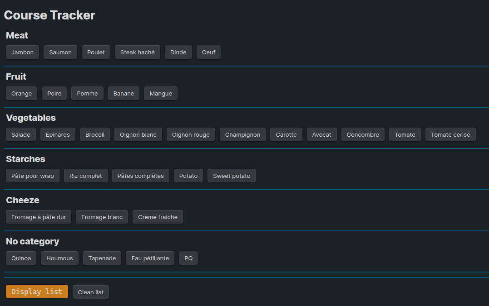
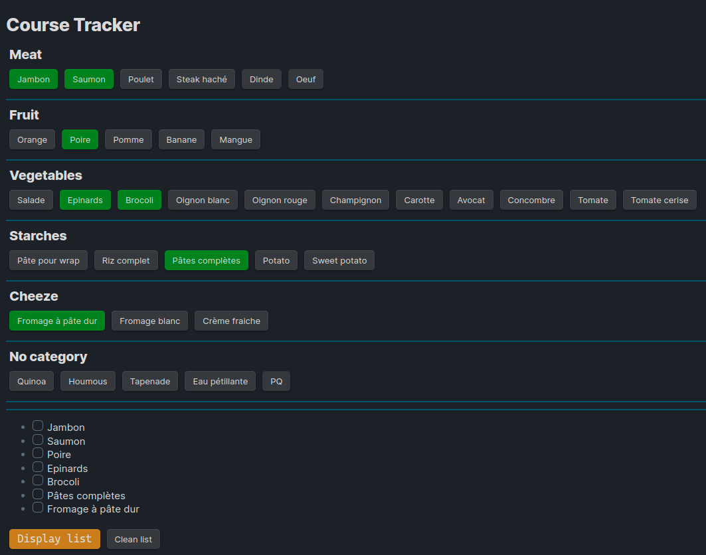

# Course tracker

This course tracker can be use for tracking your courses, assignments, and grades. It is a simple and easy to use tool that can help you stay organized and on track with your studies.

## Principe

Before you made your courses, you have just to add ingredients what you need

Once ingredients is added, you can just **Display list**

During the buying, you just mark item that you take into the store

You also can **Clear list**

## The base plugin 

## You can add ingredients and show them

- Use **Display list** for display them
- Use **Clear list** for clear the list
